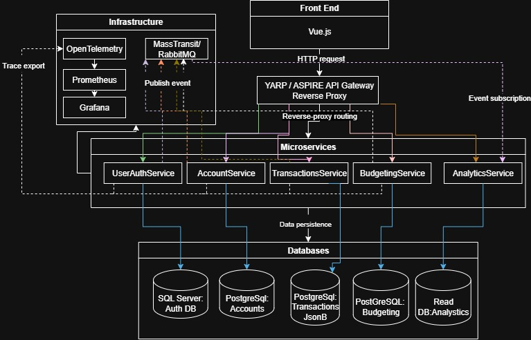

# Personal Finance Management App · DDD Microservices in .NET 9

A cloud‑native personal‑finance platform that illustrates **Domain‑Driven Design (DDD)** inside a **microservices** architecture.  
Users can link bank accounts, import & categorise transactions, set budgets, and view analytics dashboards — while you showcase clean code, event‑driven patterns, MediatR, AutoMapper, and Vue 3.

> **Status**: early skeleton. UserAuthService ping endpoint is live; Docker is on hold while WSL issues are resolved.  
> **Next up**: BankAccount aggregate (see [GitHub Issues](../../issues)).

---

## ✨ Features (roadmap)

| ✔ | Feature | Status |
|---|---------|--------|
| 🔄 | **User & Auth Service** (JWT login) | scaffolded |
| 🔄 | **Accounts Service** (Plaid link, bank sync) | not started |
| 🔄 | **Transactions Service** (import & categorisation) | not started |
| 🔄 | **Budgeting Service** (limits & alerts) | not started |
| 🔄 | **Analytics** (Vue 3 SPA dashboard) | not started |
| ✔ | **MediatR + AutoMapper wiring** | done |
| 🔄 | **Event bus** (MassTransit + RabbitMQ / SB) | pending |
| 🔄 | **Observability** (OpenTelemetry, Prometheus, Grafana) | pending |

---

## 🛠️ Technology Stack

| Layer | Choices |
|-------|---------|
| **Backend** | ASP.NET Core 8 · EF Core · SQL Server · PostgreSQL · Duende IdentityServer |
| **In‑Process Messaging** | MediatR |
| **Object Mapping** | AutoMapper |
| **Cross‑Service Events** | MassTransit · RabbitMQ / Azure Service Bus |
| **Frontend** | Vue 3 (Vite + Vuex + Vue Router) |
| **Infrastructure** |.NET Aspire • YARP API Gateway •  **Kubernetes (Helm)** — *Docker/Compose is on hold due to WSL issues* |
| **Observability** | OpenTelemetry · Prometheus · Grafana · ELK |

---

## 🧭 System Architecture




---


## 🚀 Getting Started (Windows, no Docker)

1. **Clone**
   ```powershell
   git clone https://github.com/JustMorganPowell/PersonalFinanceApp.git
   cd PersonalFinanceApp
